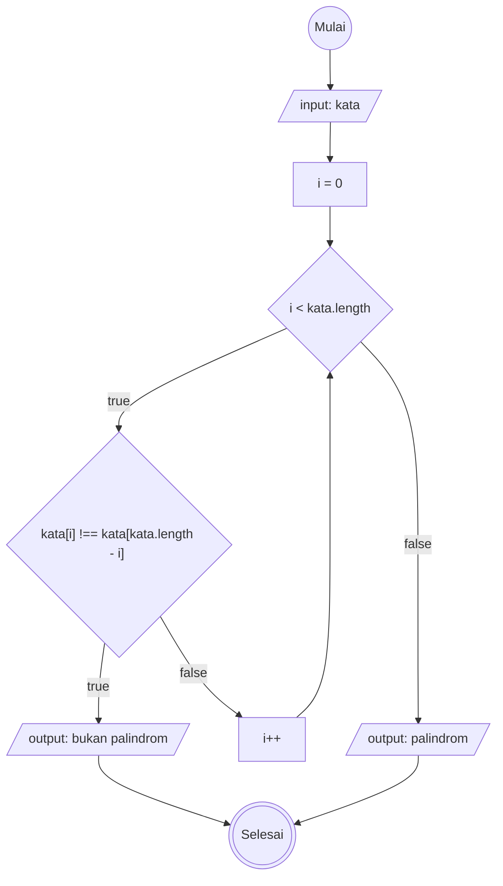
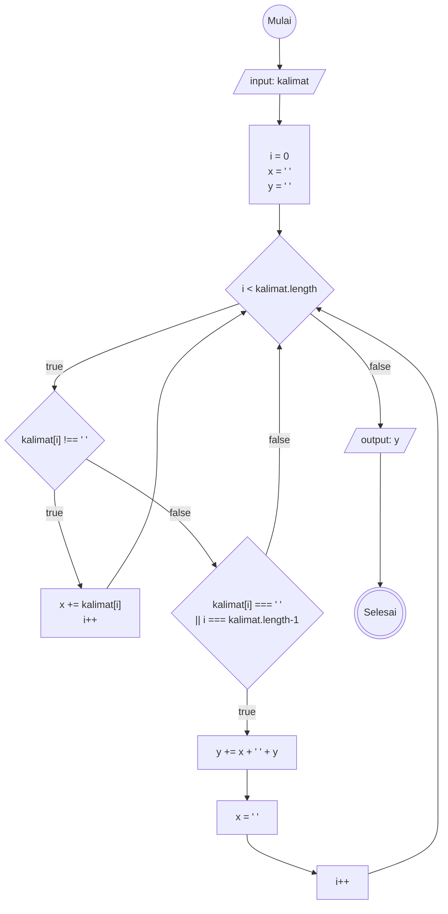

# PALINDROM

1. mulai
2. input kata
3. deklarasikan i = 0
4. jika i kurang dari panjang kata, maka
5. cek kondisi apakah index ke i dari kata adalah tidak sama dengan, index [panjang kata dikurangi i] dari kata, maka
6. cetak bukan palindrom dan lanjut langkah terakhir
7. jika index ke i dari kata adalah sama dengan index panjang kata di kurangi i dari kata, maka
8. akan lakukan increment i, kemudian lakukan langkah ke 4
9. jika i sama dengan panjang kata, maka
10. cetak palindrom
11. selesai

# REVERSED WORD

1. mulai
2. input kalimat
3. buat variabel i = 0
4. buat variabel x untuk menampung hasil perulangan dari kalimat
5. buat variabel y untuk menampung variabel x yang berisi kalimat yang sudah di looping
6. jika index ke i dari variabel kata bukan berisi spasi, maka
7. tampung index ke i dari variabel kata ke dalam variabel x
8. dan jika index ke i dari variabel kata sama dengan spasi atau i sama dengan panjang kalimat di kurangi 1
9. Masukkan nilai dari x ke y, lalu tambahkan spasi dan isi lama dari y.
10. jika sudah maka kosongkan variabel x
11. kemudian lakukan increment i sampai i sama dengan panjang kalimat di kurangi 1
12. cetak hasil variabel y
13. selesai

