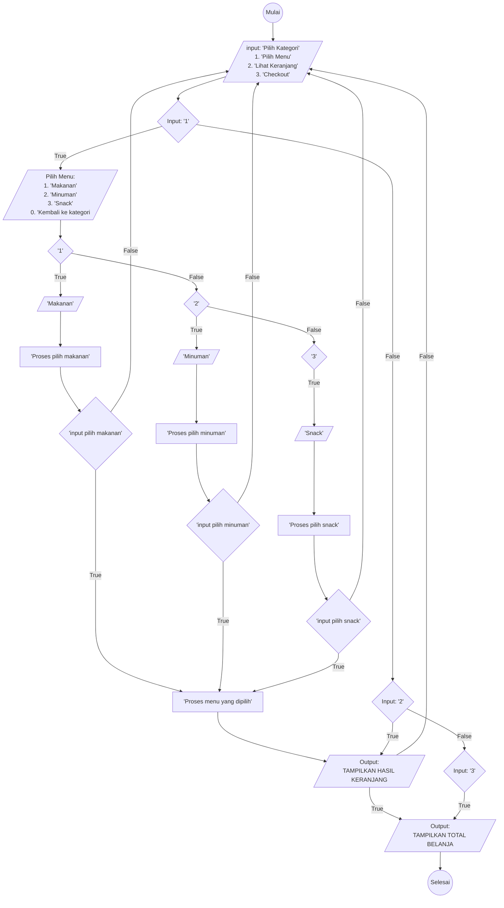

# PEMESANAN MAKANAN CLI

```mermaid
flowchart TB
a@{ shape: circle, label: "Mulai" }
b@{ shape: lean-r, label: "input: 'Pilih Kategori'
1. 'Pilih Menu'
2. 'Lihat Keranjang'
3. 'Checkout'" }
input1@{ shape: diamond, label: "Input: '1'" }
input2@{ shape: diamond, label: "Input: '2'" }
input3@{ shape: diamond, label: "Input: '3'" }
proses1@{ shape: rect, label: "'Proses menu yang dipilih'"}
checkout@{ shape: lean-r, label: "Output:
TAMPILKAN TOTAL BELANJA" }
d@{ shape: lean-r, label: "Pilih Menu:
1. 'Makanan'
2. 'Minuman'
3. 'Snack'
0. 'Kembali ke kategori" }
dfood@{ shape: diamond, label: "'1'" }
keranjang@{ shape: lean-r, label: "Output:
TAMPILKAN HASIL KERANJANG" }
makanan@{ shape: lean-r, label: "'Makanan'" }
pilihMakanan@{ shape: rect, label: "'Proses pilih makanan'"}
minuman@{ shape: lean-r, label: "'Minuman'" }
prosesM@{ shape: diamond, label: "'input pilih makanan'" }
prosesD@{ shape: diamond, label: "'input pilih minuman'" }
pilihMinuman@{ shape: rect, label: "'Proses pilih minuman'"}
snack@{ shape: lean-r, label: "'Snack'" }
prosesS@{ shape: diamond, label: "'input pilih snack'" }
pilihSnack@{ shape: rect, label: "'Proses pilih snack'"}
ddrink@{ shape: diamond, label: "'2'" }
dsnack@{ shape: diamond, label: "'3'" }
selesai@{ shape: circle, label: "Selesai" }

a --> b
b --> input1
input1 --True --> d
d --> dfood
input2 --False--> input3
proses1 --> keranjang
keranjang --True--> checkout
input1 --False--> input2
prosesM --True-->proses1
prosesD --True-->proses1
prosesS --True-->proses1
input2--True--> keranjang
input3 --True --> checkout
checkout --> selesai
dfood -- False --> ddrink
ddrink --True -->minuman
dfood --True --> makanan
ddrink --False-->dsnack
dsnack --True--> snack
makanan --> pilihMakanan
minuman --> pilihMinuman
snack --> pilihSnack
pilihMakanan --> prosesM
pilihMinuman --> prosesD
pilihSnack --> prosesS
prosesM --False --> b
prosesD --False--> b
prosesS --False-->b
keranjang --False -->b


```
